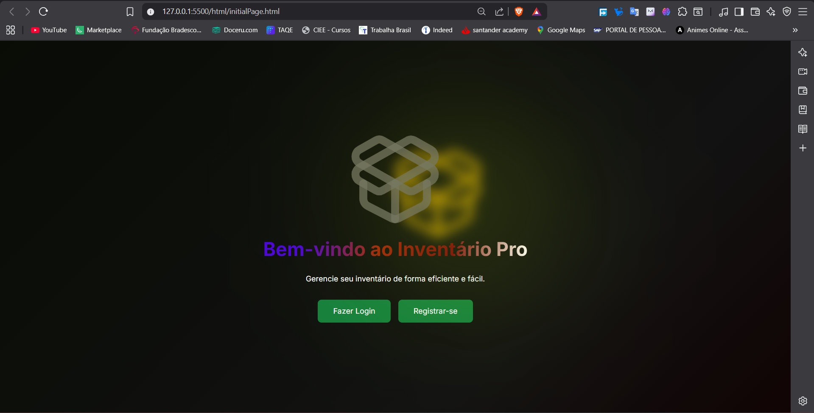
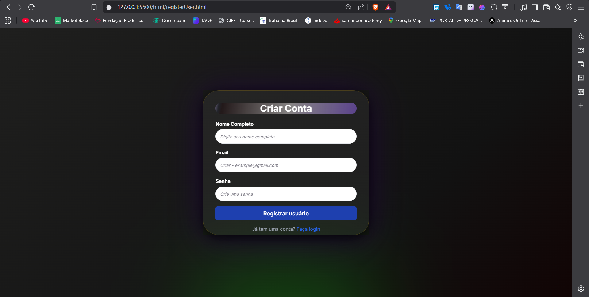
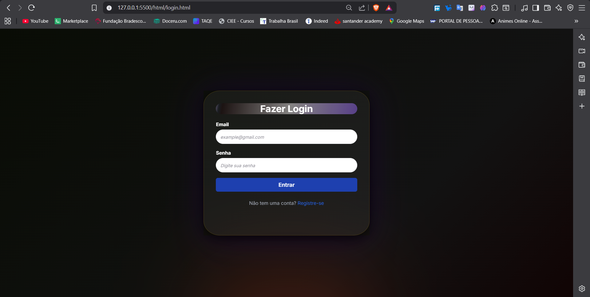
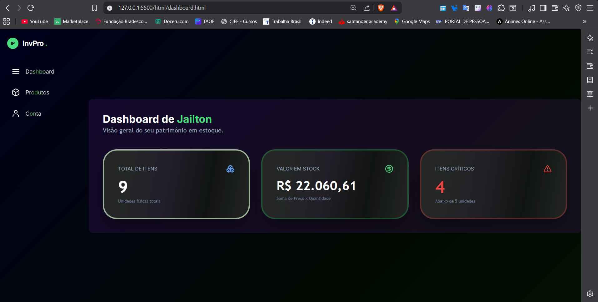
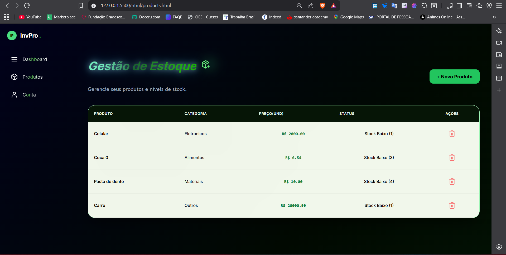
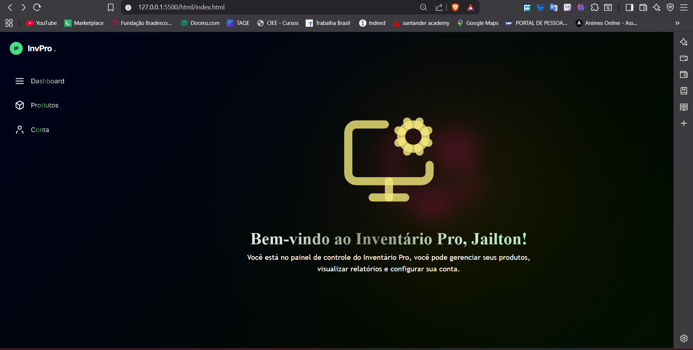
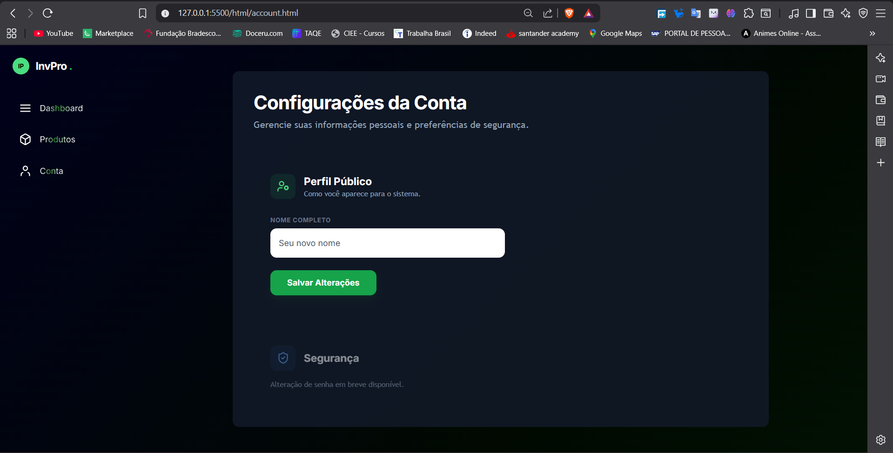

# 📦 InvPro - Gestão de Inventário Inteligente


O **InvPro** é um ecossistema completo de gerenciamento de estoque que une uma interface minimalista a uma lógica de dados robusta. O projeto foi desenvolvido como um marco na minha transição de **Backend para Full-Stack**, aplicando conceitos de persistência, sessões de usuário e agregação de dados em tempo real.

---

## 🖼️ Preview do Sistema (Vertical Stack)

### 1. Porta de Entrada
A interface inicial oferece um ponto de partida limpo e intuitivo para o usuário.


---

### 2. Registro de Usuário
Validação dinâmica de campos e critérios de senha em tempo real.


---

### 3. Tela de Login
Acesso seguro ao inventário personalizado de cada usuário.


---

### 4. Painel de Controle (Dashboard)
O coração do sistema, processando o valor total do patrimônio e itens críticos.


---

### 5. Gestão de Estoque
Listagem dinâmica de produtos com status de stock inteligente.


---

### 6. Home de Boas-vindas
Página de recepção após o login bem-sucedido.


---

### 7. Configurações de Conta
Área para gestão de perfil e preferências do usuário.


---

## 🎯 O Problema que o InvPro Resolve

No gerenciamento de pequenos estoques, a falta de ferramentas acessíveis costuma levar a três grandes problemas: **falta de visibilidade financeira**, **ruptura de estoque** (ficar sem produto) e **perda de tempo** com controles manuais em papel ou planilhas confusas.

O **InvPro** foi desenhado para atacar esses pontos diretamente:

### 1. Caos de Informação vs. Centralização Digital
- **Problema:** O gestor não sabe exatamente quantos itens tem ou onde as informações estão anotadas.
- **Solução:** Uma interface centralizada onde cada produto é categorizado e quantificado, disponível instantaneamente após o login.

### 2. Ponto Cego Financeiro vs. Valorização Real
- **Problema:** É difícil saber quanto dinheiro está "parado" nas prateleiras em tempo real.
- **Solução:** O sistema calcula automaticamente o valor total do inventário (Preço x Quantidade), transformando unidades físicas em dados financeiros estratégicos para o negócio.

### 3. Ruptura de Estoque vs. Alertas Críticos
- **Problema:** O gestor só percebe que o produto acabou quando o cliente pede, perdendo vendas.
- **Solução:** O monitor de **Stock Baixo** atua de forma preventiva. Se um item chega a 5 unidades ou menos, ele é sinalizado imediatamente como crítico, permitindo uma reposição planejada.

### 4. Gestão Compartilhada vs. Isolamento de Dados
- **Problema:** Diferentes funcionários ou sócios usando o mesmo dispositivo podem misturar dados ou bagunçar o inventário um do outro.
- **Solução:** Cada usuário possui seu próprio "banco de dados" local protegido por senha, garantindo que o inventário seja estritamente pessoal e organizado.

## ✨ Funcionalidades "Real-World"

- **Isolamento de Dados:** Os produtos são salvos em chaves exclusivas vinculadas ao email do usuário (`productsList_user@email.com`).
- **Dashboard Analítico:** Agregação de `Preço Unitário × Quantidade` para cálculo de investimento total.
- **Monitor de Crise:** Identificação automática de produtos com stock baixo (≤ 5 unidades).
- **UX Reativa:** Inputs que validam dados em tempo real com mudança de cor nas bordas (Green/Red).

---

## 🧠 Evolução Técnica

Iniciei meus estudos em **ADS (Análise e Desenvolvimento de Sistemas)** em **4 de agosto de 2025**, vindo do zero absoluto. Após 7 meses focados na lógica rigorosa do Backend (Java/Python), apliquei esse conhecimento no Frontend para criar um sistema persistente e seguro sem a necessidade imediata de um banco de dados externo.

---

## 🏗️ Como Executar

1. Clone o repositório:
   ```bash
   git clone [https://github.com/seu-usuario/invpro.git](https://github.com/seu-usuario/invpro.git)